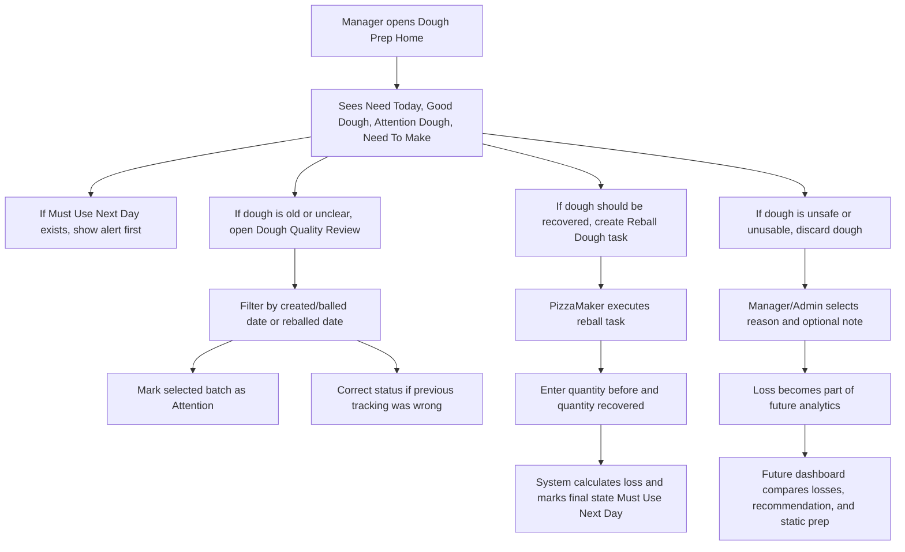

# Dough Quality App Flow

## Purpose

This document defines the functional human flow for the new Dough Quality layer.

It is a documentation-only phase meant to support:

- future screen design
- future Stitch visual prototyping
- future MVC controller and page-model work

This document does not:

- replace `DoughPrepCalculationService`
- replace `PrepWeeklyDoughCalendarService`
- implement Razor pages
- implement controllers
- change domain logic

## Operational Scope

Parlor Pizza already has planning and prep flows that answer:

- how much dough is needed
- how much dough is available
- how much dough is missing
- what prep task should be created
- what human recommendation should be saved

The Dough Quality layer adds operational quality tracking on top of that flow so the team can answer:

- which dough is still good
- which dough needs attention
- which dough was reballed
- which dough must be used next day
- which dough was discarded and why

## Core Principle

The Dough Quality layer is an operational overlay, not a planning replacement.

Planning still comes from the existing dough calculation flow.
Quality adds visibility and decisions around the dough that already exists in the kitchen.

## Roles

### Manager / Admin

- opens Dough Prep
- sees the daily summary
- reviews older dough
- marks dough as `Attention`
- corrects status if there was a tracking error
- creates or delegates reball work
- discards dough when needed
- reviews losses for future decisions

### PizzaMaker

- sees assigned dough work
- executes reball work
- records how much dough was recovered
- can report partial recovery
- cannot discard dough directly

## Status Meaning

### `Good`

Normal usable dough.

### `Attention`

Usable dough that still counts as available, but needs human review.

### `Reballed`

Operational history status for dough that went through reball handling.
In the kitchen-facing flow, the important final meaning is usually `Must Use Next Day`.

### `MustUseNextDay`

Recovered dough that still counts as available, but should be used first on the next day.

### `Discarded`

Dough that no longer counts as available and must keep a loss reason.

## Cross-Day And Cross-Week Behavior

This layer must be understood across operational days, not only inside a single screen.

- Good dough can carry from one day to the next.
- Attention dough can carry from one day to the next and still counts as available.
- Must Use Next Day dough must stay visible as a special alert until it is used or discarded.
- Discarded dough is the only state that stops counting as available by rule.
- The planning layer may move to a new week, but quality records must continue to represent real kitchen inventory across week boundaries.

This is especially important for real cases such as:

- leftover full loads from the previous week
- part of that leftover needing reball
- part of that leftover still being safe to count as available
- part of that leftover requiring special attention before service

## Current Backend Constraints To Respect

These constraints should be reflected in future controller and UX planning so the prototype does not overpromise:

- the current Dough Quality summary service returns global quality totals, not a target-date-scoped page summary
- the current discard backend works at the full tracked record level, not as a partial discard quantity workflow
- date-filtered review is possible through controller composition, even though the attention-candidate request itself only asks for a reference date

This means the first MVC layer will likely:

- compose Dough Prep planning data with Dough Quality totals for the home summary
- support full-batch discard first
- treat partial discard as a later enhancement if the team still needs it after the first release

## End-To-End Human Flow

## Flow 1: Manager Opens Dough Prep

### Goal

Help the manager decide what to do next in less than a minute.

### What the manager must see first

- `Need Today`
- `Good Dough`
- `Attention Dough`
- `Need To Make`

### Supporting alerts

- `Must Use Next Day` alert if any quantity exists
- visible human recommendation
- one clear primary action

### Primary question the screen answers

"Can today be covered safely, and what action should happen now?"

### Primary action options

The page should promote only one main action at a time:

- `Review Old Dough`
- `Create Reball Task`
- `Create Prep Task`
- `Print Kitchen Sheet`

The chosen primary action depends on the operational risk order:

1. `Must Use Next Day`
2. `Attention Dough`
3. `Need To Make`
4. `Print Kitchen Sheet`

## Flow 2: Review Old Dough

### Goal

Let a manager quickly identify older batches and decide whether they should stay `Good`, become `Attention`, or be corrected.

### Main steps

1. Open Dough Quality Review.
2. Filter by created/balled date and, when needed, reballed date.
3. View candidate batches in a simple list or card stack.
4. Mark a batch as `Attention`.
5. Correct status if the previous status is wrong.

### Key rule

Marking `Attention` is not the same as throwing dough away.
It still counts as available until a manager or admin discards it.

## Flow 3: Reball Dough

### Goal

Track the real operational outcome of trying to recover older dough.

### Main steps

1. Manager or admin creates or triggers a reball task.
2. PizzaMaker opens the task.
3. PizzaMaker sees the original quantity.
4. PizzaMaker enters recovered quantity.
5. System calculates lost quantity automatically.
6. Final batch state becomes `Must Use Next Day`.

### Key rules

- reball is never treated as 100 percent recovery
- `PartialRecovered` is allowed for PizzaMaker
- final recovered dough should be used first the next day

## Flow 4: Discard Dough

### Goal

Make discard safe, explicit, and analyzable.

### Main steps

1. Manager or admin selects a batch.
2. Manager or admin confirms discard quantity.
3. A discard reason is required.
4. An optional note explains context.
5. System records the loss for future analytics.

### Why this matters

Discard is not just a kitchen action.
It becomes operational learning for future reporting and future AI, even if AI is not implemented now.

## Flow 5: Future Dashboard

### Goal

Turn losses into coaching and planning signals later.

### Future dashboard questions

- How much dough was lost this week?
- What reasons caused the most loss?
- How much loss happened against recommended dough?
- How much loss happened against static dough planning?
- Is a pattern suggesting overproduction or poor FIFO handling?

### Non-goal for this phase

No AI implementation and no forecasting change are included in this documentation phase.

## Decision Priorities For UX

The screens should guide the user in this order:

1. Protect safe dough that must be used soon.
2. Surface dough that needs review but still counts.
3. Let staff recover dough through reball when appropriate.
4. Make discard explicit and measurable.
5. Preserve simple visibility for older users.

## Output Needed From This Flow

This human flow must lead to:

- simple screen design
- large card-first UI
- future controller contracts
- clear Stitch prompts
- future print-friendly kitchen sheet behavior
